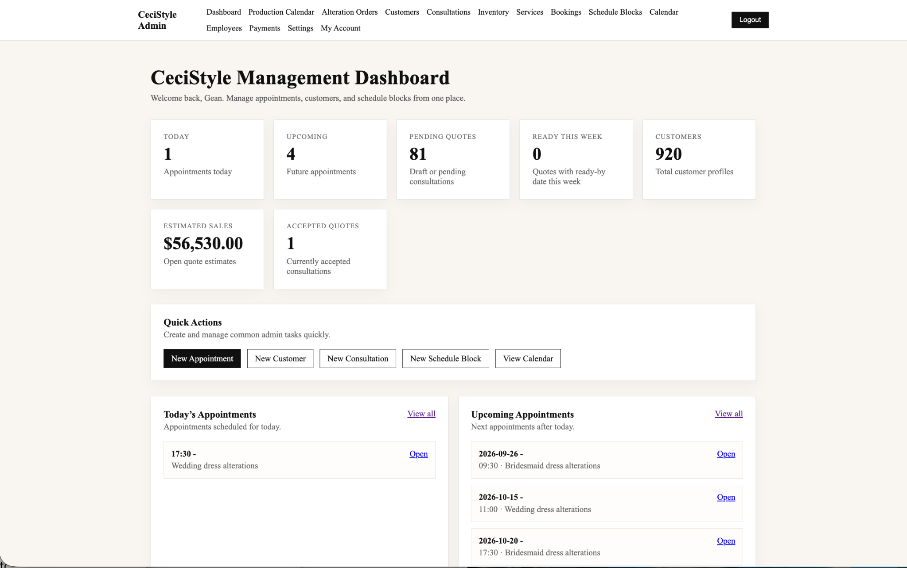
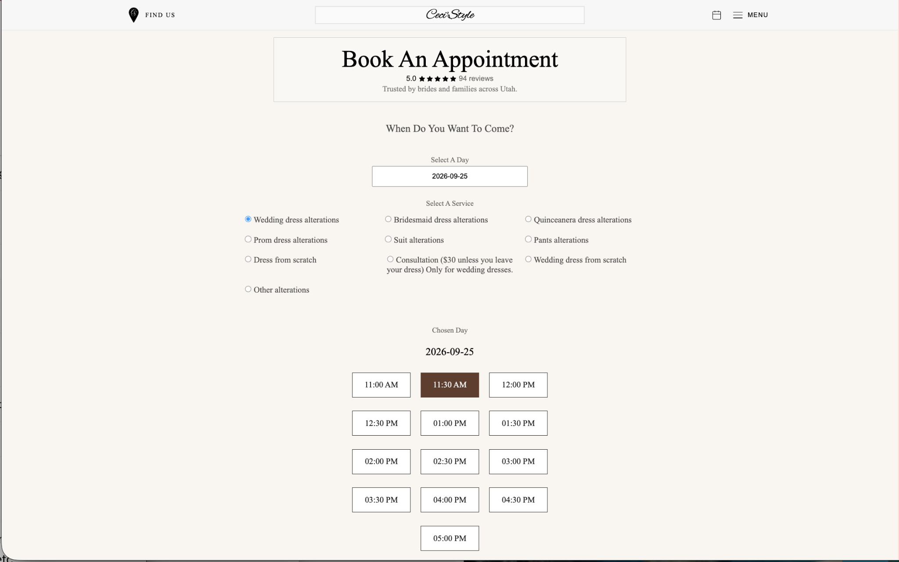
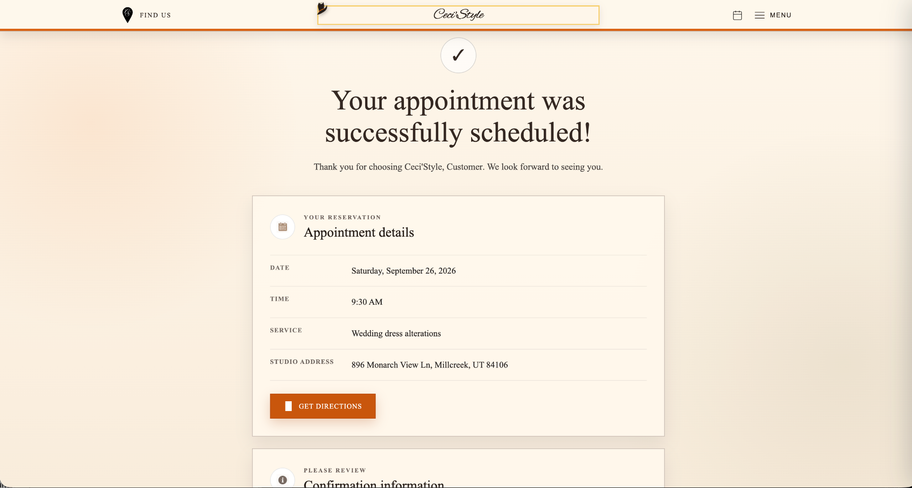
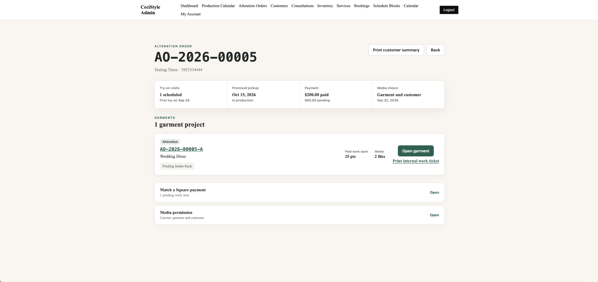
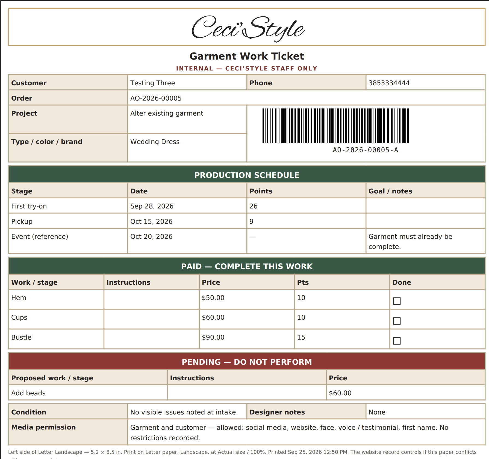
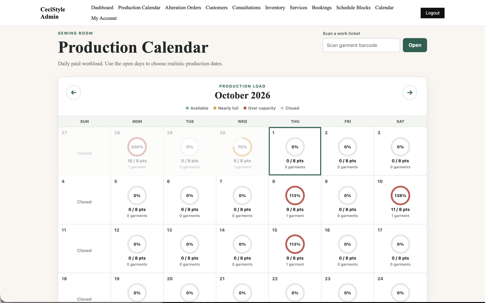
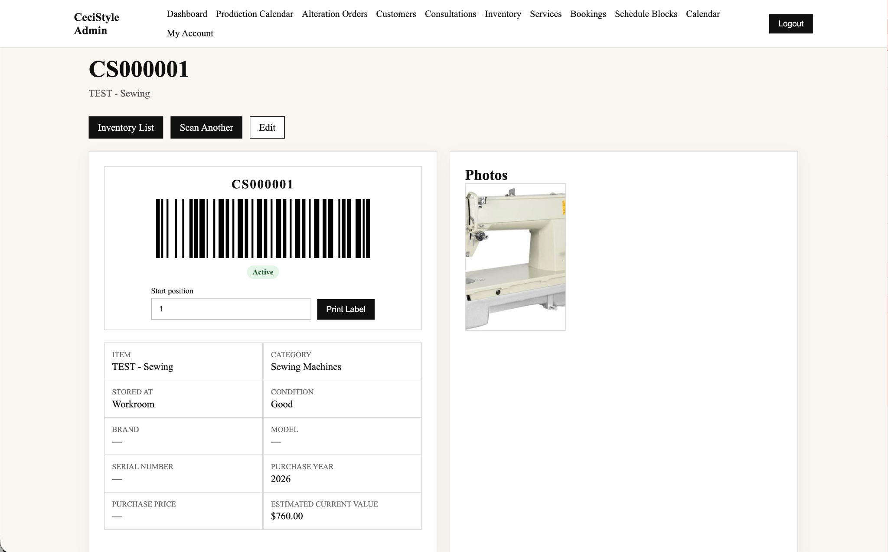
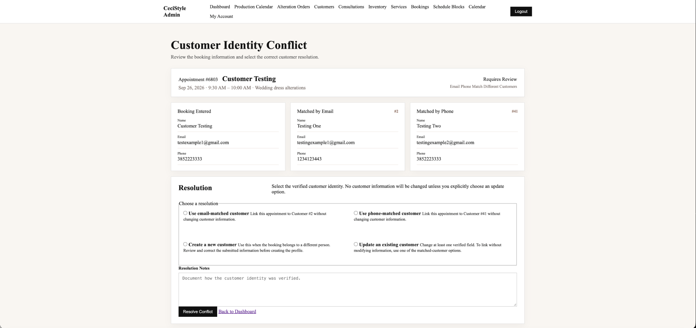

# CeciStyle Operations Platform

> Portfolio engineering showcase for a real-world Laravel business operations system.

CeciStyle Operations Platform is a full-stack business management system developed for an alterations and design business. It centralizes workflows that would otherwise be distributed across appointments, customer records, inventory, payments, garment intake, production planning, and physical garment tracking.

This repository is a **sanitized engineering showcase**, not the production application. It presents selected architecture, engineering decisions, business rules, screenshots, tests, and representative code patterns without publishing customer data, credentials, production configuration, or the complete proprietary codebase.

## Application Preview

The administrative dashboard brings customer-facing scheduling and internal operations into one staff workspace.

<p align="center">
  
</p>

## Project History

CeciStyle is an established, evolving production system rather than a project created specifically for this portfolio. Development began approximately five years before this showcase was organized, and the application has grown alongside the operational needs of the business. The recent commits in this repository reflect the creation and organization of the **portfolio showcase**, not the beginning of the underlying software project. The production application and its development history remain in a separate private repository.

## Business Problem

An alterations business must coordinate appointments, customer identity, garments, requested work, payments, production capacity, deadlines, media permissions, physical locations, and pickup. When those records live in disconnected tools or manual processes, staff can lose operational context and introduce avoidable scheduling, payment, or garment-tracking errors.

## Solution and System Capabilities

The platform models those operations as connected workflows:

- Public appointment booking with controlled availability and confirmation
- Staff administration for customers, schedules, services, and employees
- Inventory records with permanent codes and barcode-assisted lookup
- Square payment synchronization and payment-to-work matching
- Multi-garment alteration orders, production milestones, and workload allocation
- Garment work tickets, location events, and chain-of-custody history
- Customer identity conflict resolution through a Strategy Pattern
- Role-based access controls, request validation, throttling, and no-store admin responses

## Visual Workflows

### Booking and Scheduling

The public workflow exposes available appointment times, validates the submission, and returns a clear confirmation without exposing internal administrative tools.

<table>
  <tr>
    <td width="50%"></td>
    <td width="50%"></td>
  </tr>
  <tr>
    <td><strong>Availability-driven booking</strong><br>Customers select from valid appointment times.</td>
    <td><strong>Confirmed workflow result</strong><br>The system returns the created appointment details and next steps.</td>
  </tr>
</table>

### Alteration Operations and Garment Execution

An alteration order connects customer, garment, requested work, payment state, media permissions, workload, and production information. The garment work ticket turns those records into an actionable shop-floor view.

<table>
  <tr>
    <td width="50%"></td>
    <td width="50%"></td>
  </tr>
  <tr>
    <td><strong>Transactional order workflow</strong><br>Multiple operational records are created and maintained as one business process.</td>
    <td><strong>Execution-focused work ticket</strong><br>Paid and pending work, workload points, schedule, barcode, and garment details remain visible together.</td>
  </tr>
</table>

### Production Capacity Planning

The production calendar converts scheduled alteration work into visible workload percentages so staff can identify constrained dates before accepting or assigning more work.

<p align="center">
  
</p>

### Inventory Integrity and Customer Identity

These workflows demonstrate two different integrity problems: tracking physical inventory through permanent identifiers and resolving cases where booking contact details point to different customer records.

<table>
  <tr>
    <td width="50%"></td>
    <td width="50%"></td>
  </tr>
  <tr>
    <td><strong>Barcode-assisted inventory</strong><br>Permanent codes, status, condition, location, and images support traceable inventory handling.</td>
    <td><strong>Explicit identity resolution</strong><br>Staff choose a supported resolution path instead of silently merging conflicting customer data.</td>
  </tr>
</table>

## Architecture

The production system follows Laravel conventions while organizing larger business capabilities into domain-oriented modules. Controllers coordinate HTTP workflows, Form Requests validate input, service classes encapsulate business logic, Eloquent models represent the domain, and migrations enforce relational integrity.

```text
Blade / JavaScript interfaces
            ↓
Controllers + Form Requests
            ↓
Domain Services + Strategies
            ↓
Eloquent Models + Transactions
            ↓
MySQL · Square · S3-compatible storage · PDF generation
```

Detailed documentation:

- [Architecture Overview](docs/architecture.md)
- [Database Design](docs/database-design.md)
- [Security Design](docs/security.md)
- [Testing Strategy](docs/testing.md)
- [Selected Code Samples](docs/code-samples.md)

## Selected Engineering Evidence

| Evidence | Engineering concern | Details |
| --- | --- | --- |
| Customer conflict strategies | Explicit, extensible identity-resolution behavior | [Case study](docs/case-studies/customer-conflict-strategy.md) · [Code samples](docs/code-samples.md#strategy-pattern--customer-conflict-resolution) |
| Alteration order service | Transactional creation of connected operational records | [Case study](docs/case-studies/alteration-operations.md) |
| Payment matching | Row locking, ownership checks, reuse prevention, and amount validation | [Code samples](docs/code-samples.md#payment-matching-integrity) |
| Inventory service layer | Transaction boundaries, file cleanup, filtering, and audit metadata | [Case study](docs/case-studies/inventory-and-barcode-tracking.md) |
| Application controls | Authenticated sessions, roles, throttling, validation, and no-store responses | [Security design](docs/security.md) |
| Relational model | Orders, garments, work, payments, media, and location events | [Database design](docs/database-design.md) |

### Strategy Pattern Example

The booking workflow delegates customer-conflict behavior through a common contract. Its manager selects one of four concrete strategies and rejects unsupported resolution types:

```php
return match ($resolutionType) {
    'linked_email_customer' => $this->linkEmailCustomerResolution,
    'linked_phone_customer' => $this->linkPhoneCustomerResolution,
    'created_new_customer' => $this->createNewCustomerResolution,
    'updated_existing_customer' => $this->updateExistingCustomerResolution,
    default => throw new LogicException(
        'Unsupported customer conflict resolution.'
    ),
};
```

A dedicated PHPUnit unit test verifies the four mappings and the unsupported-resolution failure case. Additional excerpts are available in [Selected Code Samples](docs/code-samples.md).

## Testing Evidence

The production repository's integrated alteration-operations release reported **53 passing tests and 219 assertions** when merged. This showcase does not claim independent coverage percentages and does not contain the complete production test suite.

See the documented test approach in [Testing Strategy](docs/testing.md).

## Selected Case Studies

| Case study | Engineering concepts demonstrated |
| --- | --- |
| [Booking & Scheduling](docs/case-studies/booking-and-scheduling.md) | Availability, validation, conflict prevention, and multi-step workflows |
| [Authentication & Security](docs/case-studies/authentication-and-security.md) | Sessions, RBAC, middleware, throttling, and employee account controls |
| [Inventory & Barcode Tracking](docs/case-studies/inventory-and-barcode-tracking.md) | Service layer, filtering, lifecycle controls, and barcode-assisted operations |
| [Payments & Square](docs/case-studies/payments-and-square.md) | External payment synchronization and transactional business rules |
| [Alteration Operations](docs/case-studies/alteration-operations.md) | Domain workflow, database transactions, production planning, and garment custody |
| [Customer Conflict Resolution](docs/case-studies/customer-conflict-strategy.md) | Strategy Pattern, identity resolution, concurrency, and data integrity |

## Technology

PHP 8.2+ · Laravel 12 · MySQL · Blade · JavaScript · Vite · PHPUnit · Square SDK · AWS S3-compatible Laravel filesystem integration · DomPDF · html5-qrcode

## Repository Scope

The complete production repository remains private. This portfolio showcase is intentionally documentation-first and uses selected, sanitized examples rather than distributing a deployable copy of the business application.

No customer records, uploaded customer media, environment files, API keys, payment credentials, database dumps, or production secrets belong in this repository.

## Author

**Gean Vallejos**  
Full-Stack Web Developer — PHP, Laravel, MySQL & JavaScript

*New to Upwork, not new to software.*
