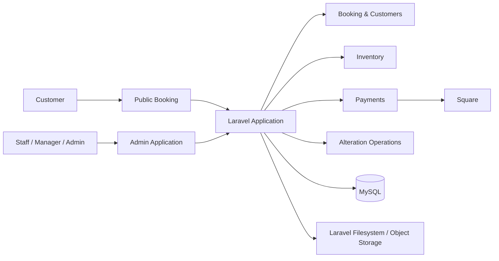

# Architecture Overview

## System Design

CeciStyle is a Laravel application combining a public customer-facing experience with an authenticated administrative system.



## Application Layers

**HTTP layer** — Routes, controllers, middleware, and Form Requests handle request boundaries, authentication, authorization, and validation.

**Domain/application layer** — Module-specific service classes contain business operations that should not live directly in controllers.

**Persistence layer** — Eloquent models and migrations represent relational data and enforce foreign-key, uniqueness, and indexing constraints.

**Presentation layer** — Blade views and modular JavaScript support administrative and customer-facing workflows.

## Domain-Oriented Modules

The production codebase uses Laravel conventions while grouping substantial business capabilities under `app/Modules`. Examples include Inventory, Payments, Customers, and Alterations.

The Alterations module demonstrates this separation particularly clearly:

```text
Alterations/
├── Controllers/
├── Requests/
└── Services/
```

Its service layer coordinates customer resolution, order creation, garment creation, production allocations, payment matching, media permission records, and garment movements using database transactions where atomicity is required.

## Authorization Boundary

Administrative alteration routes require an authenticated session and role authorization for admin, manager, or staff users. More sensitive administrative operations elsewhere in the application are further restricted to manager or admin roles, with employee administration restricted to administrators.

Sensitive synchronization and account-management actions also use request throttling.

## Portfolio Scope

This document describes verified architectural patterns from the private production repository. It intentionally omits deployable production configuration, customer data, credentials, and complete proprietary source code.
