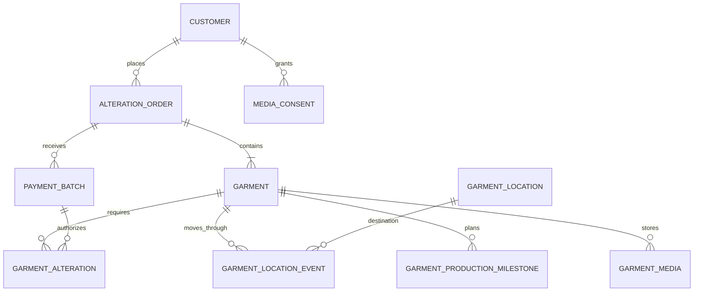

# Database Design

The production application uses relational modeling to represent operational state explicitly instead of compressing the business into a few generic records.

## Alteration Operations

Verified schema decisions include unique order and garment codes, foreign keys with explicit delete behavior, indexed operational status/date columns, separate payment batches, and an appendable garment-location event history.

Examples of deliberate referential behavior include restricting deletion where a customer or destination location is operationally required, cascading child garment records with their parent order, and nulling optional historical links where preserving the main record is preferable.

## Design Principle

The schema is designed around business events and traceability. A garment has both a current location for efficient operational lookup and location-event records for historical accountability. Payment authorization is represented separately from requested alteration work so pending and paid work remain distinguishable.

This portfolio document intentionally omits the complete production schema.
